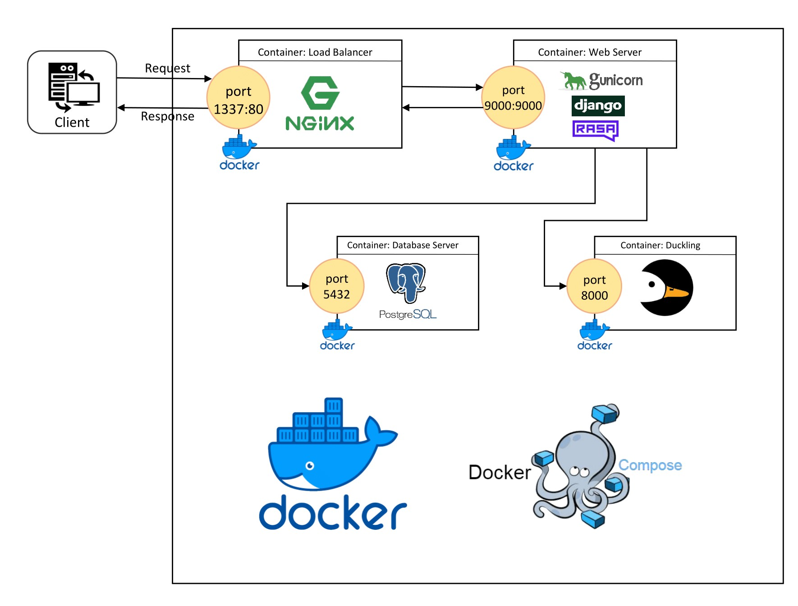

<p align="center"></p>
<h1 align="center">Financial Helper Bot 💬</h1>
<p align="center">Financial Helper Bot which can create bank accounts,
 deposit and withdraw money, check the accounts balance, answer FAQ questions and chitchat with users.</p>
<p align="center">
  
  
</p>

<p align="center">
    
</p>

## ℹ️ About
In this project, you will find a chatbot that is capable of **creating bank accounts**, **checking their balance** and **performing transactions** on these accounts. It is also capable of doing other non-financial related tasks such as **answering FAQ questions** and **chitchat** with users.

Such feats have been achieved by using the  following frameworks:
- `rasa` for the **Natural Language Processing** part of the project which is responsible for the **intent classification** (predict what the user **intends** to say) as well as `entity` and `slot` **filling** (collect the information required from the user to complete certain tasks).
- `django` as the **backend** of the project which helped to create multiple **API endpoints** to fetch (using **GET** requests) bank accounts data and also to create bank accounts and performing transactions (using **POST** requests). All of these requests are made using **Token Authentication** and the results are filtered for the authenticated user.
- `nginx` which serves both of the following functions:
    - **load balancer** for intelligently routing incoming requests to the available workers.
    - **serving static files**.
- `gunicorn` used as a **web server** as an interface between `django` and `nginx` that processes the **HTTP** requests between these two.
- `postgresql` used as a **database server** for storing users data.
- `docker` used for creating a **standardized environment** which ensures that all dependencies, code and libraries are the same across all containers made using the same `Dockerfile`.
- `docker-compose` which allows to **define and spin multiple containers**  at once and have them **share the same network** interface.

This is all summarized in the following graph:
<p align="center"></p>


## ⚛️ Demo
A quick display demo of how the bot works is presented in the following:

<div align="center">

</div>

 ## 🛠 Features
- [x] Create bank accounts (**Savings** and **Credit**)
- [x] Check the bank accounts balance
- [x] Make a transaction (**Deposit** and **Withdrawal**)
- [ ] Browse the transactions (ongoing)
- [ ] Make a transfer (ongoing)
- [x] Answer FAQ questions
- [x] Chitchat with users

## ⚠️ Prerequisites

In order to be able to work with this project, `Docker` and `docker-compose` have to be installed on the host machine.

### Install Docker

The official [Docker documentation](https://docs.docker.com/engine/install/) provides enough details to properly install `Docker` on your operating system. Please note that `docker-compose` should also be installed too.


## ⚡ Quick Setup

### Development Version Build
In order to run the development build (without nginx), run the following command:
```
docker-compose up --build
```

You can then access the bot locally by going to the following address: <a href="http://localhost:9000/bot/index">http://localhost:9000/bot/index</a>

### Deployment Version Build
In order to run the development build (using nginx), run the following command:

```
docker-compose -f docker-compose.prod.yml up --build
```

You can then access the bot locally by going to the following address: <a href="http://localhost:9000/bot/index">http://localhost:9000/bot/index</a>


## 🧪 Testing

- Test Django Features

```
docker-compose run --entrypoint="" --rm app sh -c "python manage.py wait_for_db && python manage.py makemigrations && python manage.py test"
```

- Test Rasa Features

```
docker-compose run --entrypoint="" --rm app sh -c "python manage.py wait_for_db && python manage.py makemigrations && rasa test"
```

### 👋 Contact Me

| Contact Method     |                                           |
|--------------------|-------------------------------------------|
| Email              | achrafaourik@gmail.com                    |
| LinkedIn           | https://www.linkedin.com/in/achrafaourik/ |